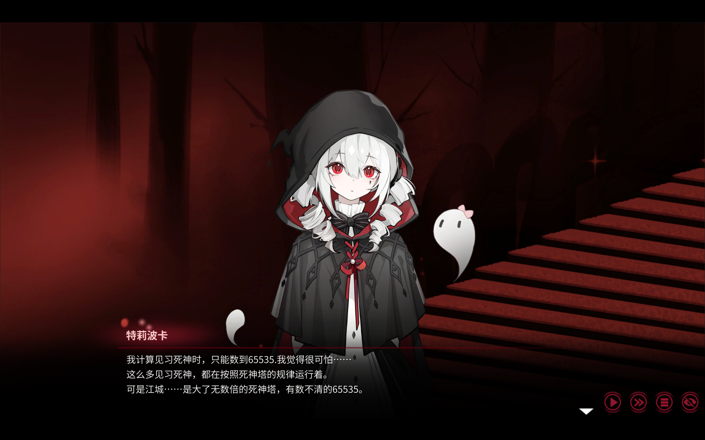

# 超绝自我介绍环节

---

## 📖 简介

一名来自杭电的大三的苦逼码农 
日常状态：写 bug → 修 bug → 被 C++ 编译器制裁 → Gameing → 继续写 bug  
人生信条：**“人和代码有一个能跑就行”**

~~找不到什么适合演示的图片，于是让死神白打工~~
---
### 🛠️ 技术栈

- **编程语言**：C++（C++17/20）、Python、C  
- **工具与环境**：VS Code、Git、GCC/Clang  
- **兴趣方向**：算法、游戏开发(只是喜欢玩游戏确信)
### 💡 目前在做

##### 🔹深入学习 C++ 设计模式与 STL 源码
- 目标是写出让下一任维护者想砍我但找不到理由的代码
##### 🔹 复现高 Star 项目
- 正在尝试复现一些有趣的开源项目
- 别人的代码是艺术品，我的代码是抽象艺术
---

## 📬 联系方式

- GitHub：恭喜你已经找到我
- 邮箱：2248765177@qq.com

技术力有限，就先写到这了，欢迎。